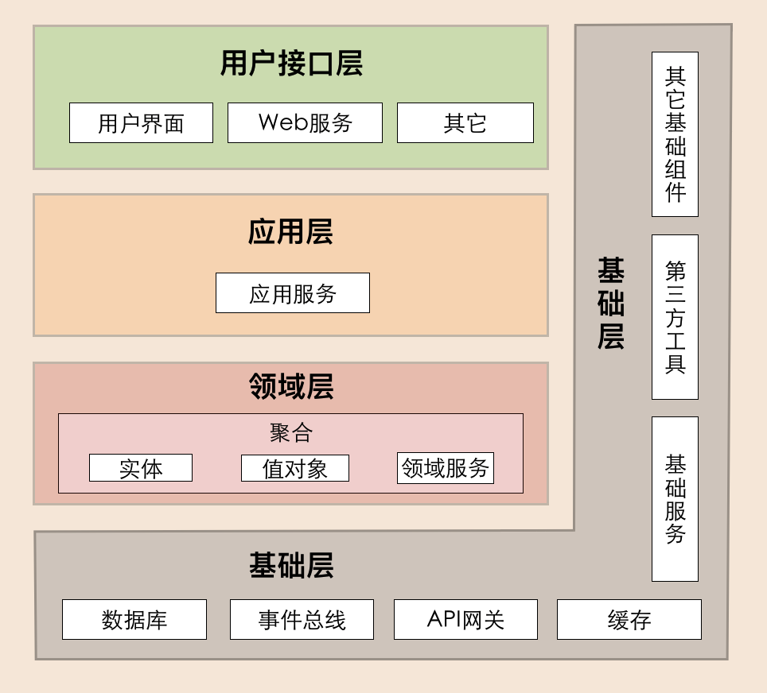
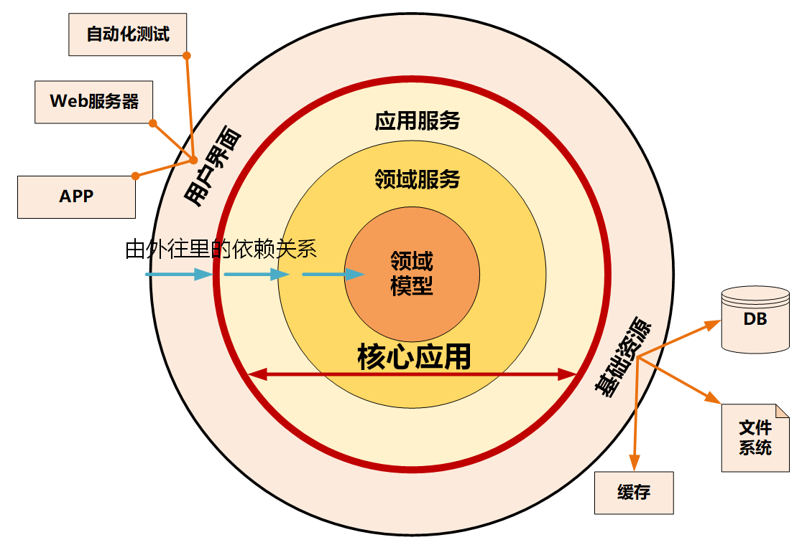

采用DDD方法建立的领域模型，可以清晰地划分微服务的逻辑边界和物理边界。

### 领域、子域、核心域、通用域、支撑域

* 领域: 要解决的业务问题域。
* 子域: 领域进一步划分出来的子领域, 对应一个更小的问题或者更小的业务范围。
* 核心域: 核心竞争力的子域。
* 通用域: 没有太多个性化诉求, 同时被多个子域使用的通用功能子域。
* 支撑域: 具有企业特性, 但不具有通用性。

### 通用语言

在事件风暴过程中，通过团队交流达成共识的，能够简单、清晰、准确描述业务涵义和规则的语言。

通用语言包含术语和用例场景，并且能够直接反映在代码中。

### 限界上下文

确定语义所在的领域边界。

可以将限界上下文拆解为两个词：限界和上下文。限界就是领域的边界，而上下文则是语义环境。

通过领域的限界上下文，就可以在统一的领域边界内用统一的语言进行交流。

#### 定义

用来封装通用语言和领域对象，提供上下文环境，保证在领域之内的一些术语、业务相关对象等（通用语言）有一个确切的含义，没有二义性。

这个边界定义了模型的适用范围，使团队所有成员能够明确地知道什么应该在模型中实现，什么不应该在模型中实现。

限界上下文是微服务设计和拆分的主要依据。

### 聚合

聚合就是由业务和逻辑紧密关联的实体和值对象组合而成的，聚合是数据修改和持久化的基本单元，每一个聚合对应一个仓储，实现数据的持久化。

聚合在DDD分层架构里属于领域层。

跨多个实体的业务逻辑通过领域服务来实现，跨多个聚合的业务逻辑通过应用服务来实现。

一次业务用例只会更新一个聚合根。

#### 聚合根

聚合根的主要目的是为了避免由于复杂数据模型缺少统一的业务规则控制，而导致聚合、实体之间数据不一致性的问题。

如果把聚合比作组织，那聚合根就是这个组织的负责人。聚合根也称为根实体，它不仅是实体，还是聚合的管理者。

首先它作为实体本身，拥有实体的属性和业务行为，实现自身的业务逻辑。

其次它作为聚合的管理者，在聚合内部负责协调实体和值对象按照固定的业务规则协同完成共同的业务逻辑。

最后在聚合之间，它还是聚合对外的接口人，以聚合根ID关联的方式接受外部任务和请求，在上下文内实现聚合之间的业务协同。也就是说，聚合之间通过聚合根ID关联引用，如果需要访问其它聚合的实体，就要先访问聚合根，再导航到聚合内部实体，外部对象不能直接访问聚合内实体。

#### 设计聚合

DDD领域建模通常采用事件风暴，它通常采用用例分析、场景分析和用户旅程分析等方法，通过头脑风暴列出所有可能的业务行为和事件，然后找出产生这些行为的领域对象，并梳理领域对象之间的关系，找出聚合根，找出与聚合根业务紧密关联的实体和值对象，再将聚合根、实体和值对象组合，构建聚合。

判断一个实体是否是聚合根，你可以结合以下场景分析：是否有独立的生命周期？是否有全局唯一ID？是否可以创建或修改其它对象？是否有专门的模块来管这个实体。

#### 总结

<strong>聚合的特点</strong>：高内聚、低耦合，它是领域模型中最底层的边界，可以作为拆分微服务的最小单位，但我不建议你对微服务过度拆分。但在对性能有极致要求的场景中，聚合可以独立作为一个微服务，以满足版本的高频发布和极致的弹性伸缩能力。

一个微服务可以包含多个聚合，聚合之间的边界是微服务内天然的逻辑边界。有了这个逻辑边界，在微服务架构演进时就可以以聚合为单位进行拆分和组合了，微服务的架构演进也就不再是一件难事了。

<strong>聚合根的特点</strong>：聚合根是实体，有实体的特点，具有全局唯一标识，有独立的生命周期。一个聚合只有一个聚合根，聚合根在聚合内对实体和值对象采用直接对象引用的方式进行组织和协调，聚合根与聚合根之间通过ID关联的方式实现聚合之间的协同。

<strong>实体的特点</strong>：有ID标识，通过ID判断相等性，ID在聚合内唯一即可。状态可变，它依附于聚合根，其生命周期由聚合根管理。实体一般会持久化，但与数据库持久化对象不一定是一对一的关系。实体可以引用聚合内的聚合根、实体和值对象。

<strong>值对象的特点</strong>：无ID，不可变，无生命周期，用完即扔。值对象之间通过属性值判断相等性。它的核心本质是值，是一组概念完整的属性组成的集合，用于描述实体的状态和特征。值对象尽量只引用值对象。

### 事件

事件基本属性至少包括：事件唯一标识、发生时间、事件类型和事件源。

### 微服务架构模型

#### DDD分层架构

实体或值对象的简单变更，一般不会让领域模型和微服务发生大的变化。但聚合的重组或拆分却可以。这是因为聚合内业务功能内聚，能独立完成特定的业务逻辑。那聚合的重组或拆分，势必就会引起业务模块和系统功能的变化了。

#### 整洁架构

整洁架构的层就像洋葱片一样，它体现了分层的设计思想。

整洁架构最主要的原则是依赖原则，它定义了各层的依赖关系，越往里依赖越低，代码级别越高，越是核心能力。外圆代码依赖只能指向内圆，内圆不需要知道外圆的任何情况。

在洋葱架构中，各层的职能是这样划分的：

- 领域模型实现领域内核心业务逻辑，它封装了企业级的业务规则。领域模型的主体是实体，一个实体可以是一个带方法的对象，也可以是一个数据结构和方法集合。
- 领域服务实现涉及多个实体的复杂业务逻辑。
- 应用服务实现与用户操作相关的服务组合与编排，它包含了应用特有的业务流程规则，封装和实现了系统所有用例。
- 最外层主要提供适配的能力，适配能力分为主动适配和被动适配。主动适配主要实现外部用户、网页、批处理和自动化测试等对内层业务逻辑访问适配。被动适配主要是实现核心业务逻辑对基础资源访问的适配，比如数据库、缓存、文件系统和消息中间件等。
- 红圈内的领域模型、领域服务和应用服务一起组成软件核心业务能力。

#### 六边形架构

又名端口适配器架构。

#### 三种微服务架构模型的对比和分析

虽然DDD分层架构、整洁架构、六边形架构的架构模型表现形式不一样，但你不要被它们的表象所迷惑，这三种架构模型的设计思想正是微服务架构高内聚低耦合原则的完美体现，而它们身上闪耀的正是以领域模型为中心的设计思想。

DDD分层架构、整洁架构、六边形架构都是以领域模型为核心，实行分层架构，内部核心业务逻辑与外部应用、资源隔离并解耦。

### Q&A

Q: 领域事件采用消息异步机制，发布方和订阅方数据如何保证一致性？微服务内聚合之间领域事件是否一定要用事件总线？

A: 在对数据一致性要求比较高的业务场景，发送方和订阅方的事件数据都必须落库，发送方除了保存业务数据以外，在往消息中间件发布消息之前，会先将要发布的消息写入本地库。而接收方在处理消息之前，需要先将收到的消息写入本地库。

然后可以采用定期对发布方和订阅方的事件数据对账的操作，识别出不一致的数据。如果数据出现异常或不一致的情况，可以启动定时程序再次发送，必要时可以转人工操作处理。

### 构建中台业务模型

#### 自顶向下的策略

自顶向下的策略适用于全新的应用系统建设，或旧系统推倒重建的情况。基于业务现状，暂时不考虑系统现状。

* 将领域分解为子域，子域可以分为核心域、通用域和支撑域。
* 对子域建模，划分领域边界，建立领域模型和限界上下文。
* 根据限界上下文进行微服务设计。

#### 自底向上的策略

基于业务和系统现状完成领域建模，适用于遗留系统业务模型的演进式重构。

* 锁定系统所在业务域，构建领域模型。

* 对齐业务域，构建中台业务模型。
* 中台归类，根据领域模型设计微服务。

### 事件风暴

领域建模的过程主要包括产品愿景、业务场景分析、领域建模和微服务拆分与设计这几个重要阶段。

#### 领域建模

* 从命令和事件中提取产生这些行为的实体。
* 根据聚合根的管理性质从实体中找出聚合根，将聚合根以及它关联的实体和值对象组合为聚合。
* 划定限界上下文，根据上下文语义将聚合归类。

#### 微服务拆分与设计

在微服务拆分与设计时，我们不能简单地将领域模型作为拆分微服务的唯一标准，它只能作为微服务拆分的一个重要依据。

微服务的设计还需要考虑服务的粒度、分层、边界划分、依赖关系和集成关系。

除了考虑业务职责单一外，我们还需要考虑将敏态与稳态业务的分离、非功能性需求（如弹性伸缩要求、安全性等要求）、团队组织和沟通效率、软件包大小以及技术异构等非业务因素。

### 代码模型

主要考虑的是微服务的边界、分层以及架构演进。

#### 一级目录

微服务一级目录是按照DDD分层架构的分层职责来定义。

* Interfaces(用户接口层)
* Application(应用层)
* Domain(领域层)
* Infrastructure(基础层)

#### 总目录

### 微服务边界在架构演进中的作用

微服务的重要特征----演进式架构。

演进式架构就是以支持增量的、非破坏的变更作为第一原则，同时支持在应用程序结构层面的多维度变化。

随着业务的发展或需求的变更，在不断重新拆分或者组合成新的微服务的过程中，不会大幅增加软件开发和维护的成本，并且这个架构演进的过程是非常轻松、简单的。

### 基于DDD的微服务设计实例

#### 战略设计

根据用户旅程分析，找出领域对象和聚合根，对实体和值对象进行聚类组成聚合，划分限界上下文，建立领域模型的过程。

#### 战术设计

战术设计包括以下两个阶段：分析微服务领域对象和设计微服务代码结构。

### 微服务演进策略

#### 绞杀者策略

绞杀者策略是一种逐步剥离业务能力，用微服务逐步替代原有单体系统的策略。

#### 修缮者策略

修缮者策略是一种维持原有系统整体能力不变，逐步优化系统整体能力的策略。